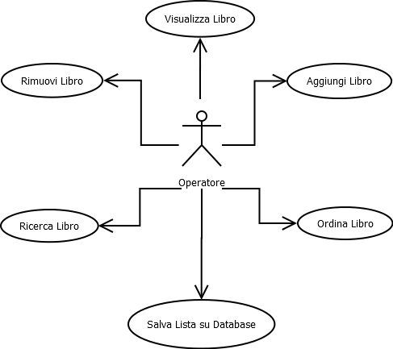

# Title of the project

## Design Requirement Specification Document

 <b> Authors </b>   AA   BB  

### REVISION HISTORY

Version | Data | Author(s)| Notes
---------|------|--------|------
1 | XX/YY/ZZ | AA   BB | First Versionn of the document. Document Template

## Table of Content

1. [Introduction](#intro)
    1. [Purpose and Scope](#purpose)  
    2. [Definitions](#def)
    3. [Document Overview](#overview)
    4. [Bibliography](#biblio)
2. [Project Description](#description)
    1. [Project Introduction](#project-intro)
    2. [Technologies used](#tech)
    3. [Assumptions and Constraints](#constraints)
3. [System Overview](#system-overview)
    1. [System Architecture](#architecture)
    2. [System Interfaces](#interfaces)
    3. [System Data](#data)
        1. [System Inputs](#inputs)
        2. [System Outputs](#outputs)
4. [System Module 1](#sys-module-1)
    1. [Structural Diagrams](#sd)
        1. [Class Diagram](#cd)
            1. [Class Description](#cd-description)
        2. [Object Diagram](#od)
        3. [Dynamic Models](#dm)
5. [System Module 2](#sys-module-2)
   1. ...

##    1 Introduction

    
 The design specification document reflects the design and provides directions to the builders and coders of the product.
 
    Through this document, designers communicate the design for the product to which the builders or coders must comply. The design specification should state how the design will meet the requirements.

    
###  1.1 Purpose and Scope

 
    
 The goal of this section is to describe the purpose of this document and intended audience  

    
This sub section should describe ...

###  1.2 Definitions

 
    
 Put a summary of the section
    

    
This sub section should describe ...

    
| First Header  | Second Header |
| ------------- | ------------- |
| Content Cell  | Content Cell  |
| Content Cell  | Content Cell  |
    

###  1.3 Document Overview

 
    
 Explain how is organized the document
    

    
This sub section should describe ...

###  1.4 Bibliography

 
    
 Put a summary of the section
    

    
This sub section should describe ...

##  2 Project Description

###  2.1 Project Introduction 

 
    
  Describe at an high level what is the goal of the project and a possible solution
    

    
This sub section should describe ...

###  2.2 Technologies used

 
    
 Description of the overall architecture. 

    
Graphical representation of the system architecture.  May be composed by multiple diagrams depending on the differences in the environment
specifications    

###  2.3 Assumption and Constraint 

 
    
 Put a summary of the section
    

    
This sub section should describe ...

##   3 System Overview

 
    
 Put a summary of the section
    

    
This sub section should describe ...

###   3.1 System Architecture

 
    
 Put a summary of the section
    

    
This sub section should describe ...

###   3.2 System Interfaces

 
    
 Put a summary of the section
    

    
This sub section should describe ...

###   3.3 System Data

 
    
 Put a summary of the section
    

    
This sub section should describe ...

####   3.3.1 System Inputs

 
    
 Put a summary of the section
    

    
This sub section should describe ...

####   3.3.2 System Ouputs

 
    
 Put a summary of the section
    

    
This sub section should describe ...

##   4 System Module 1

 
    
 Put a summary of the section
    

    
This sub section should describe ...

###   4.1 Structural Diagrams

 
    
 Put a summary of the section
    

    
This sub section should describe ...

####   4.1.1 Class diagram

 
    
 Put a summary of the section
    

    
This sub section should describe ...

#####   4.1.1.1 Class Description

 
    
 Put a summary of the section
    

    
This sub section should describe ...

####   4.1.2 Object diagram

 
    
 Put a summary of the section
    

    
This sub section should describe ...

####   4.2 Dynamic Models

 
    
 Put a summary of the section
    

    
This sub section should describe ...

@Project Priority
Permettere ad un operatore di modificare, eliminare e aggiungere libri all'interno di un database virtuale.

**# ATTORI**

1) operatore : colui che aggiunge, rimuove o modifica libri nel Database

#OPERATORE : 

casi d'uso =

1) Aggiunta libro da Database

2) Rimozione libro da Database

3) Modifica libro da Database

**Scenario Principale 1**

1) Operatore seleziona "Aggiungi Libro".

2) Computer notifica all'utente di inserire i dati del libro.

**3) Inserimento Dati**

4) Controllo in Database se dato 4 (ISBN) è già presente all'interno del Database

5) Aggiunta del libro nel Database

6) Computer notifica operatore che l'operazione è avvenuta con successo

7) Computer pulisce schermo e ritorna alla schermata iniziale.

##BRANCA OPZIONE 3:

1.0) lettura input primo dato: TITOLO
##CONTROLLO SU INPUT##
1.1) lettra input secondo dato: AUTORE
##CONTROLLO SU INPUT##
1.2) lettra input terzo dato: DATA PUBBLICAZIONE
##CONTROLLO SU INPUT##
1.3) lettra input quarto dato: IS
##CONTROLLO SU INPUT##

**Scenario Alternativo 4A**

1.A) L'ISBN è già presente in archivio
		
     2.A) Computer notifica che un libro con un codice ISBN uguale è già salvato all'interno dell'archivio

     3.A) Computer mostra all'operatore il libro con lo stesso ISBN 

     4.A) Coomputer chide di scegliere all'operatore che opzione preferisce tra "Annulla operazione | modifica libro tentato di inserire | modifica libro già presente in archivio"

**Scenario Alternativo 4AB**

1.AB) Computer notifica che l'operazione è stata annullata

    2.AB)  Computer esegue direttamente **Scenario principale 7)**

**Scenario Alternativo 4AC**

1.AC) Computer notifica all'operatore di reinserire l'ISBN 

    2.AC)  Computer ritona nuovamente a **BRANCA OPZIONE 3   1.3)** 

**Scenario Alternativo 4AD**

1.AC) Computer esegue **Scenario Principale 3**

**Scenario Principale 2**

1) Operatore seleziona "Rimozione Libro".

2) Computer richiede di inserire all'operatore l'ISBN del libro da rimuovere

3) Computer esegue funzioni **Scenario Principale 1, 3)**

4) Computer esegue funzioni **Scenario Principale 1, 4)** 

6) Computer notifica operatore che l'operazione è avvenuta con successo

7) Computer pulisce schermo e ritorna alla schermata iniziale.

**Scenario Alternativo 24A**

2.A) L'ISBN non è presente in archivio

     2.A) Coomputer informa che all'operatore che l'ISBN immesso non è presente in archvio

	2.A) Computer chiede all'operatore se vuole reinserire l'ISBN o uscire

	2.A) Computer trova l'ISBN

	2.A) Computer torna a **Scenario Principale 2 6)**

**Scenario Alternativo 24AB**

2.AB) l'operatore sceglie di reinserire ISBN

     3) Computer esegue funzioni **Scenario Principale 1, 3)**

**Scenario Alternativo 24AC**

1.AB) Computer notifica che l'operazione è stata annullata

    2.AB)  Computer esegue direttamente **Scenario principale 7)**

**Scenario Principale 3**

1) Operatore seleziona "Modifica Libro".

2) Computer richiede di inserire all'operatore l'ISBN del libro da modificare

3) Computer esegue funzioni **Scenario Principale 1, 3)**

4) Computer esegue funzioni **Scenario Principale 1, 4)** 

6) Computer notifica operatore che l'operazione è avvenuta con successo

7) Computer pulisce schermo e ritorna alla schermata iniziale.

**Scenario Alternativo 34A**

3.A) Computer esegue funzioni **Scenario Alternativo 224AB**

**Scenario Alternativo 34AB**

3.AB) 3.A) Computer esegue funzioni **Scenario Alternativo 24AB**

**Scenario Alternativo 24AC**

3.AB) Computer esegue funzioni **Scenario Alternativo 24AB**

