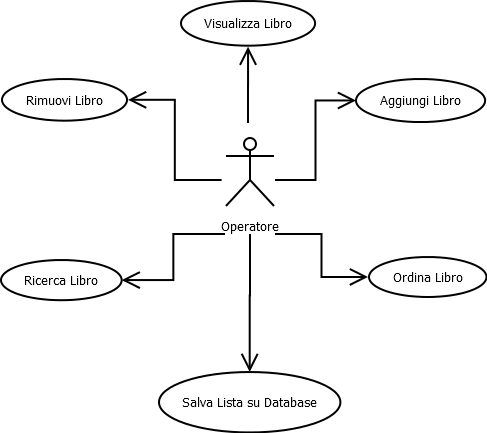

### User Requirements Specification Document

**VERSION : 1.0**

**Authors**  
Aurino
Matteo

**REVISION HISTORY**

| Version    | Date        | Authors      | Notes        |
| 1.0 | 27/06/2024 | Aurino Matteo | added png pic! |
| X.X |  | |  |

# Table of Contents

1. [Introduction](#p1)
	1. [Document Scope](#sp1.1)
	2. [Definitios and Acronym](#sp1.2) 
	3. [References](#sp1.3)
2. [System Description](#p2)
	1. [Context and Motivation](#sp2.1)
	2. [Project Objectives](#sp2.2)
3. [Requirement](#p3)
 	1. [Stakeholders](#sp3.1)
 	2. [Functional Requirements](#sp3.2)
 	3. [Non-Functional Requirements](#sp3.3)
  
  

## 1. Introduction

### 1.1 Document Scope

### 1.2 Definitios and Acronym

| Acronym				| Definition | 
| ------------------------------------- | ----------- | 
| XXXX                                  | XXXX |

### 1.3 References 

## 2. System Description

### 2.1 Context and Motivation

### 2.2 Project Obectives 

## 3. Requirements

| Priorità | Significato | 
| --------------- | ----------- | 
| M | **Mandatory:**   |
| D | **Desiderable:** |
| O | **Optional:**    |
| E | **future Enhancement:** |

### 3.1 Stakeholders

### 3.2 Functional Requirements 

| ID | Descrizione | Priorità |
| --------------- | ----------- | ---------- | 
| 1.0 |  XXXXX |M|

### 3.2 Non-Functional Requirements 
 
| ID | Descrizione | Priorità |
| --------------- | ----------- | ---------- | 
| 1.0 | XXXXX |M|

@Project Priority
Permettere ad un operatore di modificare, eliminare e aggiungere libri all'interno di un database virtuale.

**# ATTORI**

1) operatore : colui che aggiunge, rimuove o modifica libri nel Database

#OPERATORE : 

casi d'uso =

1) Aggiunta libro da Database

2) Rimozione libro da Database

3) Modifica libro da Database

**Scenario Principale 1**

1) Operatore seleziona "Aggiungi Libro".

2) Computer notifica all'utente di inserire i dati del libro.

**3) Inserimento Dati**

4) Controllo in Database se dato 4 (ISBN) è già presente all'interno del Database

5) Aggiunta del libro nel Database

6) Computer notifica operatore che l'operazione è avvenuta con successo

7) Computer pulisce schermo e ritorna alla schermata iniziale.

##BRANCA OPZIONE 3:

1.0) lettura input primo dato: TITOLO
##CONTROLLO SU INPUT##
1.1) lettra input secondo dato: AUTORE
##CONTROLLO SU INPUT##
1.2) lettra input terzo dato: DATA PUBBLICAZIONE
##CONTROLLO SU INPUT##
1.3) lettra input quarto dato: IS
##CONTROLLO SU INPUT##

**Scenario Alternativo 4A**

1.A) L'ISBN è già presente in archivio
		
     2.A) Computer notifica che un libro con un codice ISBN uguale è già salvato all'interno dell'archivio

     3.A) Computer mostra all'operatore il libro con lo stesso ISBN 

     4.A) Coomputer chide di scegliere all'operatore che opzione preferisce tra "Annulla operazione | modifica libro tentato di inserire | modifica libro già presente in archivio"

**Scenario Alternativo 4AB**

1.AB) Computer notifica che l'operazione è stata annullata

    2.AB)  Computer esegue direttamente **Scenario principale 7)**

**Scenario Alternativo 4AC**

1.AC) Computer notifica all'operatore di reinserire l'ISBN 

    2.AC)  Computer ritona nuovamente a **BRANCA OPZIONE 3   1.3)** 

**Scenario Principale 2**

1) Operatore seleziona "Rimozione Libro".

2) Computer richiede di inserire all'operatore l'ISBN del libro da rimuovere

3) Computer esegue funzioni **Scenario Principale 1, 3)**

4) Computer esegue funzioni **Scenario Principale 1, 4)** 

6) Computer notifica operatore che l'operazione è avvenuta con successo

7) Computer pulisce schermo e ritorna alla schermata iniziale.

**Scenario Alternativo 24A**

2.A) L'ISBN non è presente in archivio

     2.A) Coomputer informa che all'operatore che l'ISBN immesso non è presente in archvio

	2.A) Computer chiede all'operatore se vuole reinserire l'ISBN o uscire

	2.A) Computer trova l'ISBN

	2.A) Computer torna a **Scenario Principale 2 6)**

**Scenario Alternativo 24AB**

2.AB) l'operatore sceglie di reinserire ISBN

     3) Computer esegue funzioni **Scenario Principale 1, 3)**

**Scenario Alternativo 24AC**

1.AB) Computer notifica che l'operazione è stata annullata

    2.AB)  Computer esegue direttamente **Scenario principale 7)**

**Scenario Principale 3**

1) Operatore seleziona "Modifica Libro".

2) Computer richiede di inserire all'operatore l'ISBN del libro da modificare

3) Computer esegue funzioni **Scenario Principale 1, 3)**

4) Computer esegue funzioni **Scenario Principale 1, 4)** 

6) Computer notifica operatore che l'operazione è avvenuta con successo

7) Computer pulisce schermo e ritorna alla schermata iniziale.

**Scenario Alternativo 34A**

3.A) Computer esegue funzioni **Scenario Alternativo 224AB**

**Scenario Alternativo 34AB**

3.AB) 3.A) Computer esegue funzioni **Scenario Alternativo 24AB**

**Scenario Alternativo 24AC**

3.AB) Computer esegue funzioni **Scenario Alternativo 24AB**

